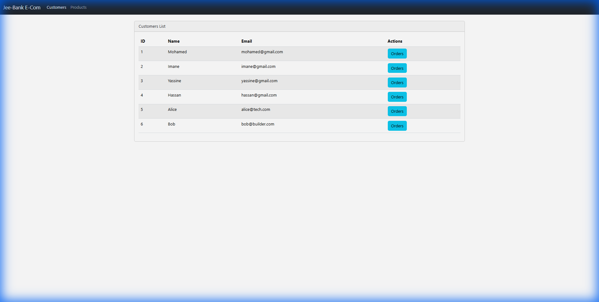
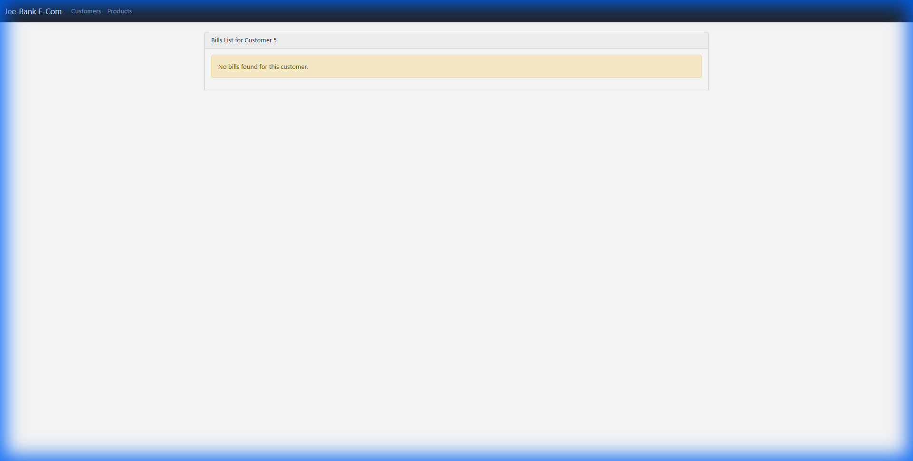

# Classwork 3: Angular Frontend Client

## Activity: Angular Framework - Frontend for Microservices

This project demonstrates an Angular application consuming Spring Boot microservices.

## Features
- Angular 17+ with Standalone Components
- Bootstrap 5 for styling
- HTTP Client for API integration
- Routing and Navigation
- Customer, Products, and Bills views

## Project Structure
```
angular-client/
├── src/app/
│   ├── customers/          # Customer list component
│   ├── products/           # Products list component
│   ├── bills/              # Bills component
│   ├── services/           # HTTP services
│   ├── app.routes.ts       # Route definitions
│   └── app.component.ts    # Root component
├── package.json
└── angular.json
```

## Prerequisites
- Node.js 18+
- npm 9+

## How to Run
```bash
cd angular-client
npm install
ng serve
```

## Access
Open http://localhost:4200

## API Integration
The frontend connects to microservices via the Gateway at `http://localhost:8888`

## Author
Youssef Atertour - EMSI 2025

---

## Proof Screenshots

### Customers List


### Products List


### Bills View (Customer Orders)



